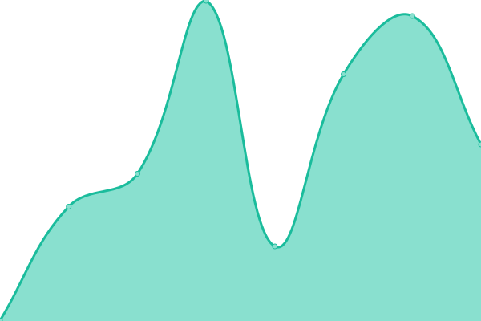
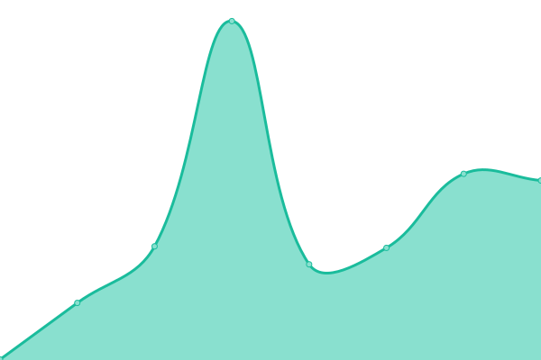

# [📈 Live Status](https://status.kvipp.io): <!--live status--> **🟩 All systems operational**

This repository contains the open-source uptime monitor and status page for [DigiQuip AS](https://digiquip.no), powered by [Upptime](https://github.com/upptime/upptime).

With [Upptime](https://upptime.js.org), you can get your own unlimited and free uptime monitor and status page, powered entirely by a GitHub repository. We use [Issues](https://github.com/digiquip/Upptime/issues) as incident reports, [Actions](https://github.com/digiquip/Upptime/actions) as uptime monitors, and [Pages](https://status.kvipp.io) for the status page.

<!--start: status pages-->
<!-- This summary is generated by Upptime (https://github.com/upptime/upptime) -->
<!-- Do not edit this manually, your changes will be overwritten -->
<!-- prettier-ignore -->
| URL | Status | History | Response Time | Uptime |
| --- | ------ | ------- | ------------- | ------ |
|  [Kvipp](https://test.kvipp.io/health) | 🟩 Up | [kvipp.yml](https://github.com/digiquip/Upptime/commits/HEAD/history/kvipp.yml) | 

 457ms
     
 | 

<a href="https://status.kvipp.io/history/kvipp">100.00%</a>
    

|  [DigiQuip Registry](https://registry.kvipp.io) | 🟩 Up | [digi-quip-registry.yml](https://github.com/digiquip/Upptime/commits/HEAD/history/digi-quip-registry.yml) | 

 356ms
     
 | 

<a href="https://status.kvipp.io/history/digi-quip-registry">100.00%</a>
    

|  [DigiQuip Main Service](https://demo.digiquip.com/) | 🟩 Up | [digi-quip-main-service.yml](https://github.com/digiquip/Upptime/commits/HEAD/history/digi-quip-main-service.yml) | 

 600ms
     
 | 

<a href="https://status.kvipp.io/history/digi-quip-main-service">100.00%</a>
    

|  [DigiQuip Website](https://digiquip.no) | 🟩 Up | [digi-quip-website.yml](https://github.com/digiquip/Upptime/commits/HEAD/history/digi-quip-website.yml) | 

 340ms
     
 | 

<a href="https://status.kvipp.io/history/digi-quip-website">100.00%</a>
    

|  [DigiQuip PIM](https://pim.digiquip.com) | 🟩 Up | [digi-quip-pim.yml](https://github.com/digiquip/Upptime/commits/HEAD/history/digi-quip-pim.yml) | 

 560ms
     
 | 

<a href="https://status.kvipp.io/history/digi-quip-pim">100.00%</a>
    

|  [DigiQuip Translation](https://translate.digiquip.com) | 🟩 Up | [digi-quip-translation.yml](https://github.com/digiquip/Upptime/commits/HEAD/history/digi-quip-translation.yml) | 

 463ms
     
 | 

<a href="https://status.kvipp.io/history/digi-quip-translation">100.00%</a>
    

<!--end: status pages-->

[**Visit our status website →**](https://status.kvipp.io)

## 📄 License

- Powered by: [Upptime](https://github.com/upptime/upptime)
- Code: [MIT](./LICENSE) © [Anand Chowdhary](https://anandchowdhary.com), supported by [Pabio](https://pabio.com)
- Data in the `./history` directory: [Open Database License](https://opendatacommons.org/licenses/odbl/1-0/)
